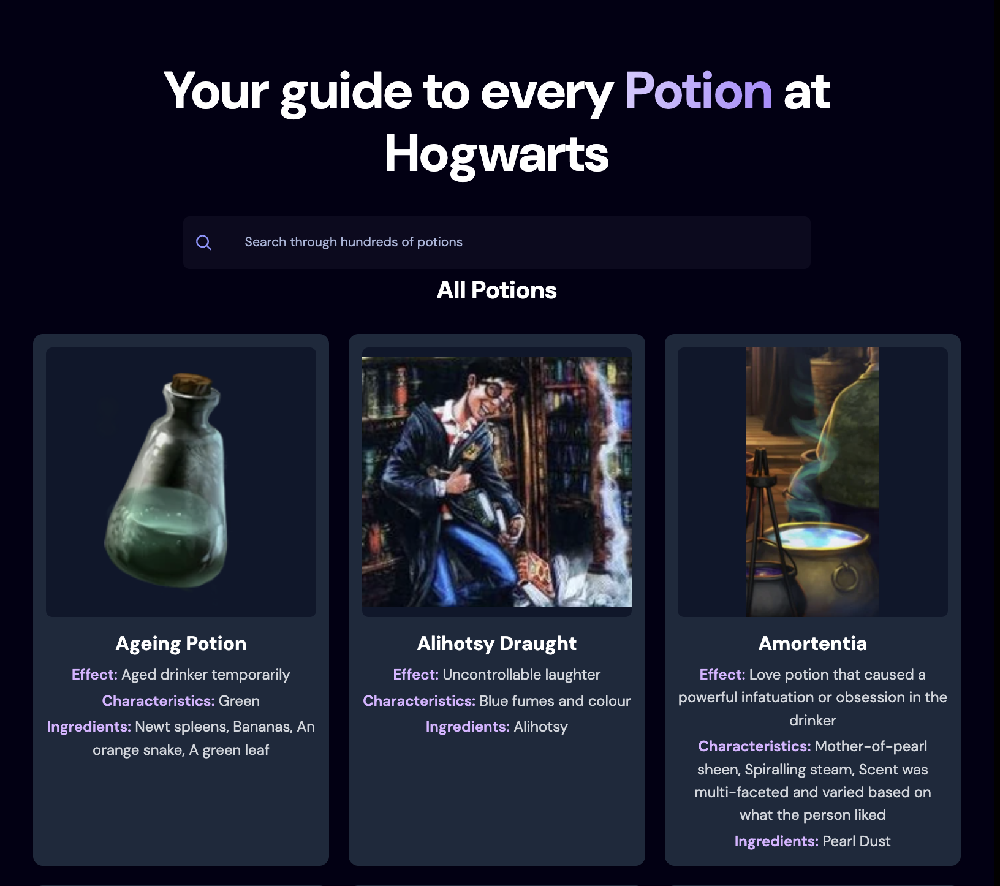
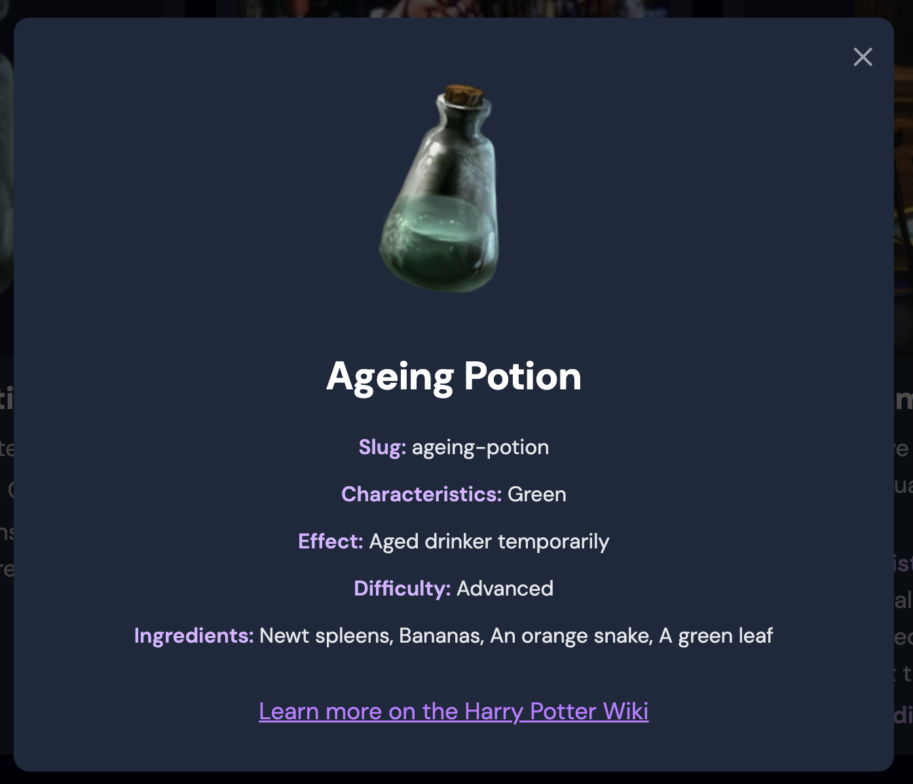

# ⚗️ Potions Guide

A Harry Potter–themed React app that lets you explore Hogwarts potions.  
Browse all available potions from the [Potter DB API](https://potterdb.com/), search by name, and view detailed potion information in a modal popup.

---

## ✨ Features

- 📖 **Browse all potions** – pulled from the Potter DB API
- 🔎 **Search with debounce** – smooth searching without spamming the API
- 💡 **Potion details modal** – click on a potion card to see its full details
- 📱 **Responsive design** – works seamlessly on mobile, tablet, and desktop
- 🎨 **Styled with TailwindCSS** – modern, clean, Hogwarts-themed look
- 🪄 **Fallback images** – shows a placeholder if no potion image is available

---

## 🖼️ Screenshots

### Home Page

### Potion Details Modal

---

## 🚀 Tech Stack

- [React](https://react.dev/) – frontend framework
- [Vite](https://vitejs.dev/) – dev/build tool
- [TailwindCSS](https://tailwindcss.com/) – styling
- [Potter DB API](https://potterdb.com/) – potion data source

---
